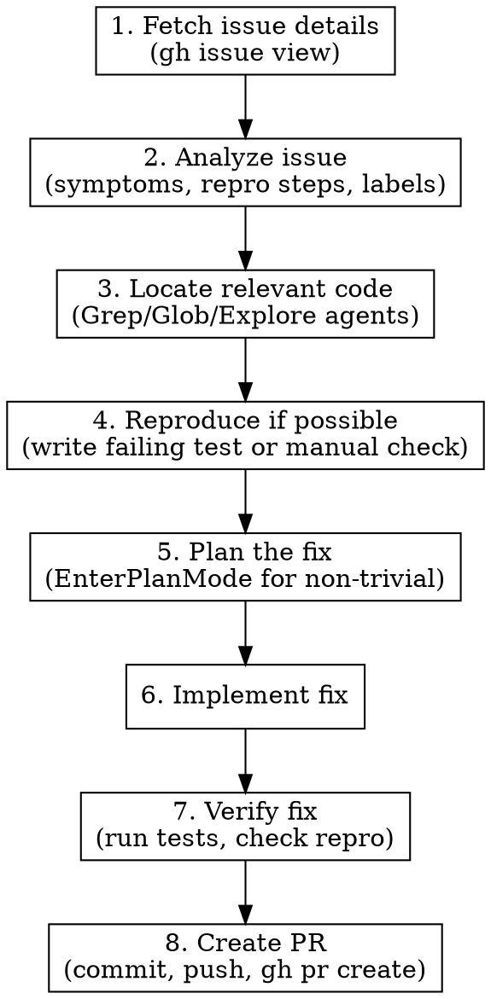

# Fix Bug from GitHub Issue

## Overview

Systematic workflow for turning a GitHub issue into a working fix: fetch context, reproduce, locate root cause, plan fix, implement, verify, and create a PR.

## Workflow



## Step Details

### 1. Fetch Issue

Extract issue info using `gh`:

```bash
# From URL: https://github.com/owner/repo/issues/123
gh issue view 123 --json title,body,labels,comments,state

# From another repo
gh issue view 123 --repo owner/repo --json title,body,labels,comments,state
```

If given a URL, parse the owner/repo/number from it. If given just `#123` or `123`, use the current repo.

### 2. Analyze Issue

Extract from the issue:
- **What's broken**: Expected vs actual behavior
- **Reproduction steps**: How to trigger the bug
- **Environment**: Version, OS, config if mentioned
- **Labels/comments**: May reveal affected area, priority, prior investigation
- **Linked PRs/issues**: Check for related context

### 3. Locate Relevant Code

Use the issue details to search the codebase:
- Search for error messages, function names, or file paths mentioned in the issue
- Use Explore agents for broad searches, Grep/Glob for targeted ones
- Trace the code path from entry point to the failure

### 4. Reproduce

If tests exist:
- Write a failing test that captures the bug (TDD approach)

If no test infrastructure applies:
- Identify the code path and confirm the logic flaw by reading

### 5. Plan the Fix

For non-trivial fixes (multi-file, architectural impact): use `EnterPlanMode`.

For simple fixes (single function, clear root cause): proceed directly.

### 6. Implement

- Fix the root cause, not just the symptom
- Keep changes minimal and focused
- Follow existing code conventions

### 7. Verify

- Run existing tests: ensure no regressions
- Run new test (if written in step 4): confirm it passes
- Review the diff: does it address the issue fully?

### 8. Create PR

Once the fix is verified:

1. **Create a branch** (if not already on one):
   ```bash
   git checkout -b fix/issue-123
   ```

2. **Commit changes** with a descriptive message referencing the issue:
   ```bash
   git add <changed-files>
   git commit -m "Fix: <short description>

   Closes #123"
   ```

3. **Push and create the PR**:
   ```bash
   git push -u origin fix/issue-123
   gh pr create --title "Fix: <short description>" --body "$(cat <<'EOF'
   ## Summary
   <What was broken and how this fixes it>

   ## Changes
   <Bullet list of changes>

   Closes #123

   ## Test plan
   - [ ] Existing tests pass
   - [ ] New test covers the bug scenario (if applicable)
   EOF
   )"
   ```

4. **Return the PR URL** to the user.

Key points:
- Reference the issue number with `Closes #N` so it auto-closes on merge
- Keep the PR title concise (under 70 characters)
- Include a test plan in the PR body
- If the issue is from another repo, link it manually in the body

## Parsing Issue References

| Input | How to fetch |
|-------|-------------|
| `https://github.com/owner/repo/issues/42` | `gh issue view 42 --repo owner/repo` |
| `#42` or `42` | `gh issue view 42` (current repo) |
| `owner/repo#42` | `gh issue view 42 --repo owner/repo` |

## Common Mistakes

- **Fixing symptoms instead of root cause**: Trace the full code path before patching
- **Skipping reproduction**: A fix without a repro is a guess
- **Scope creep**: Fix the reported issue, don't refactor surrounding code
- **Missing edge cases**: Check if the fix handles related scenarios mentioned in comments
